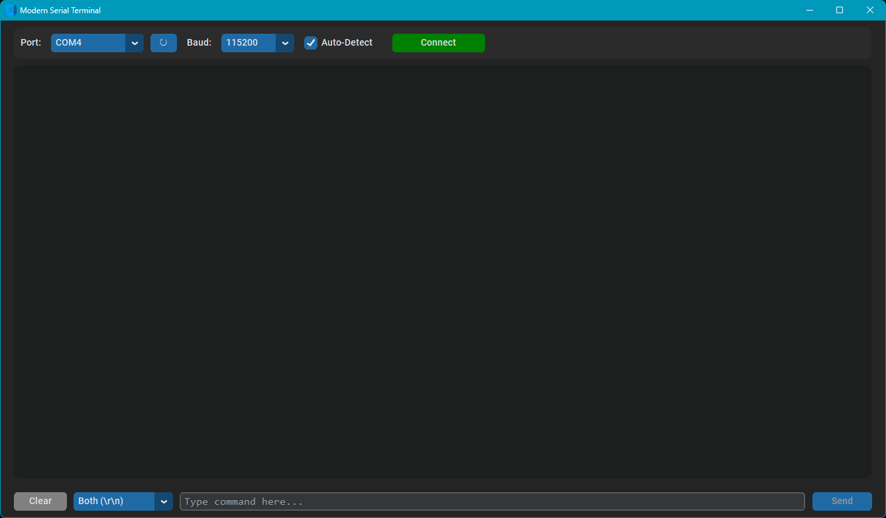

# Serial Terminal

A modern GUI-based serial port communication tool for interacting with microcontrollers and serial devices. Built with Python and CustomTkinter for a clean, dark-themed interface.

## Features

- **Port Management** - Automatic detection of available COM ports with refresh functionality
- **Baud Rate Configuration** - Support for standard baud rates (300 to 115200)
- **Auto-Baud Detection** - Automatically scans and detects the correct baud rate
- **Real-time Communication** - Asynchronous reading using threading to prevent UI freezing
- **Configurable Line Endings** - Choose between None, `\n`, `\r`, or `\r\n`
- **Persistent Settings** - Saves and restores user preferences between sessions
- **Visual Feedback** - Clear distinction between sent (TX) and received data

## Screenshot



The application features a dark-themed interface with:
- Port and baud rate selection dropdowns
- Connect/Disconnect toggle button
- Terminal display area for received data
- Input field for sending commands
- Clear terminal button

## Requirements

- Python 3.12+
- customtkinter
- pyserial

## Installation

1. Clone the repository:
   ```bash
   git clone https://github.com/dhahaj/terminal-app.git
   cd terminal-app
   ```

2. Create and activate a virtual environment:
   ```bash
   python -m venv .venv

   # Windows
   .venv\Scripts\activate

   # macOS/Linux
   source .venv/bin/activate
   ```

3. Install dependencies:
   ```bash
   pip install customtkinter pyserial
   ```

## Usage

Run the application:
```bash
python serial_app.py
```

### Basic Workflow

1. Select a COM port from the dropdown (click Refresh to update the list)
2. Choose a baud rate or enable Auto Detect to find it automatically
3. Click **Connect** to establish the connection
4. Type commands in the input field and press Enter to send
5. Received data appears in the terminal display

### Settings

Settings are automatically saved to `serial_settings.json` when the application closes:
- Selected port
- Baud rate
- Line ending preference
- Auto-detect flag

## License

MIT
